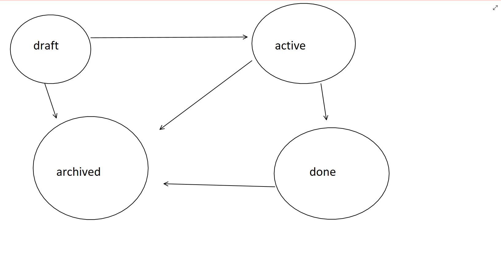

# Task API

## A simple CRUD API to interact with a task

### Task Schema:
ID: Primary key
<br />
Title: String
<br />
State: Element in the set [ draft → active → done → archived]
<br />
<br />

### Transition between states must obey the following FSM
<br />
<br />




Run Insrucions: 
<br />
```
pip3 install -r requirements.txt
python manage.py makemigrations && python manage.py migrate && python manage.py runserver 0.0.0.0:8000
```

Docker: 
```
docker build --tag task .
docker run --publish 8000:8000 -d --name task-server task
```

Usage:
<br/>
    ```curl localhost:8000 ```

    Welcome to the Task-API!